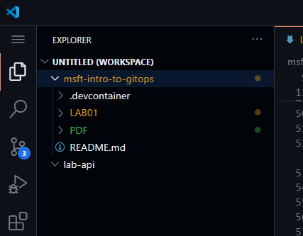

# Lab Guide #

## Create and Clone Directory ##

In this step, you will set up your GitHub authentication and create a new repository for your project. First, update your GITHUB_TOKEN environment variable with the value stored in your CodeSpaces Secrets by running the provided command in the terminal. This allows you to authenticate with GitHub beyond the current project or repository. To make the token persist across terminal sessions, add it to your .bashrc file. Next, use the gh repo create command to create a new repository named lab-api. The --public flag makes the repository public, and the --add-readme flag ensures the repository includes a default README.md file. After creating the repository, retrieve its URL using the gh repo view command with the --json and --jq options to extract the URL. Finally, clone the repository to your local development environment using the git clone command, navigate into the cloned directory with cd, and add it to your Visual Studio Code workspace using the code -a command. This setup prepares your workspace for further development.

1. First we need to update our GITHUB_TOKEN with the version stored in our CodeSpaces Secrets. You do this by running the following command in the Terminal. This will allow us to authenticate to GitHub beyond our current project/repo that you just cloned ```msft-intro-to-gitops```. 

    ```sh
    # Set GITHUB_TOKEN from our CodeSpace Variable
    GITHUB_TOKEN=$CONFIG_GITHUB_TOKEN

    # Lets make this survive restarts by adding to our .bashrc file. 
    echo 'GITHUB_TOKEN=$CONFIG_GITHUB_TOKEN' >> ~/.bashrc
    ```
---
2. Use the gh repo create command to create a new repository named lab-api:

    ```sh
    gh repo create lab-api --public --add-readme
    ```

    > Here's an explanation of how the above commands work. 
    >>- ```--public```: makes the repository public (you can omit this if you want it private).
    >>- ```--clone```**(OPTIONAL)**: tells GitHub CLI to clone the repository to your local environment immediately after creating it. 
    >>- ```--add-readme```: Tells GitHub CLI to make sure the new repo includes a default README.md document in the main branch. *_Every Repo should have a default README.md_*.
---
3. Now lets collect the Repo URL to a Variable so we can use git to clone it down to our local system: _(the previous step's output would have included the URL. But it is good to know how to retrieve it should you need too and add it to Variable for ease of access.)_

    ```sh
    GH_REPO_URL=$(gh repo view lab-api --json url --jq '.url')
    ```
    ```sh
    # TERMINAL OUTPUT:
    @BenTheBuilder-MSFTLabs ➜ /workspaces $ gh repo view lab-api --json url --jq '.url'
    https://github.com/BenTheBuilder-MSFTLabs/lab-api
    ```
    > Here's an explanation of how the above commands work. 
    >>- ```gh repo view```: This tells GitHub CLI to view details about a repository.
    >>- ```lab-api```: This is the name of the repository you are trying to view. In this case, it's a repository named lab-api. 
    >>- ```--json```: This option specifies that you want to get the repository's data in JSON format.
    >>- ```url```: This tells GitHub CLI that you only want to retrieve the URL of the repository in the JSON output.
    >>- ```---jq '.url'```: This flag is used to filter the JSON output using a JQ expression. jq is a lightweight and flexible command-line JSON processor that allows you to extract and manipulate JSON data easily. It tells jq to extract the value of the url key from the JSON response.

    Let's add this Variable to our .bashrc so it is autocreated/populated if our workspace restarts/timesout. 
    ```sh
    echo "GH_REPO_URL=$GH_REPO_URL" >> ~/.bashrc
    ```

    Verify that our .bashrc is updated successfully
    ```sh
    tail -n 2 ~/.bashrc
    ```
    ```sh
    # TERMINAL OUTPUT:
    @BenTheBuilder-MSFTLabs ➜ /workspaces/msft-intro-to-gitops (main) $ tail -n 2 ~/.bashrc
    GITHUB_TOKEN=$CONFIG_GITHUB_TOKEN
    GH_REPO_URL=https://github.com/BenTheBuilder-MSFTLabs/lab-api
    @BenTheBuilder-MSFTLabs ➜ /workspaces/msft-intro-to-gitops (main) $
    ```
---
4. Clone the repository you created on GitHub to your local development environment and add it to your Visual Studio Code workspace.

    Use the ```cd``` or (Change Directory) command to move you up one directory level to '/workspaces' in your current file system. You don't want to add another Repository inside an existing one. 
    ```sh
    cd .. 
    ```

    The ```git clone``` command uses Git to clone the repository from the specified URL to your local machine. Cloning creates a local copy of the repository, including all its files and history. 

    ```repo
    git clone $GH_REPO_URL
    ```
    ```sh
    # TERMINAL OUTPUT:
    @BenTheBuilder-MSFTLabs ➜ /workspaces $ git clone $GH_REPO_URL
    Cloning into 'lab-api'...
    remote: Enumerating objects: 3, done.
    remote: Counting objects: 100% (3/3), done.
    remote: Total 3 (delta 0), reused 0 (delta 0), pack-reused 0 (from 0)
    Receiving objects: 100% (3/3), done.
    ```

        This command opens the current directory ($PWD, which stands for "Present Working Directory") in Visual Studio Code and adds it to the existing workspace. The -a flag ensures that the directory is added to the current workspace instead of replacing it. 

    ```sh
    code -a /workspaces/lab-api/
    ```

    >**NOTE**  
    > This will cause your workspace browser window to refresh. This is expected and okay, just continue. 

    Your workspace in VSCode should now contain two working directories. ```msft-intro-to-gitops``` and ```lab-api```, the latter of which is currently empty.

    


    After cloning the repo down, ```cd /workspaces/lab-api``` navigates into the newly created lab-api directory, which contains the cloned repository.

    ```sh
    cd /workspaces/lab-api
    ```
    ```sh
    # TERMINAL OUTPUT:
    # Notice the prompt changed to indicate you are in the (main) branch of the lab-api repo. 
    @BenTheBuilder-MSFTLabs ➜ /workspaces/msft-intro-to-gitops (main) $ cd /workspaces/lab-api/
    @BenTheBuilder-MSFTLabs ➜ /workspaces/lab-api (main) $ 
    ```


---
# End of Lab 

[⬅ Back to LABGUIDE](LABGUIDE.md) | [Next to LAB02 ➡](LAB02.md)
