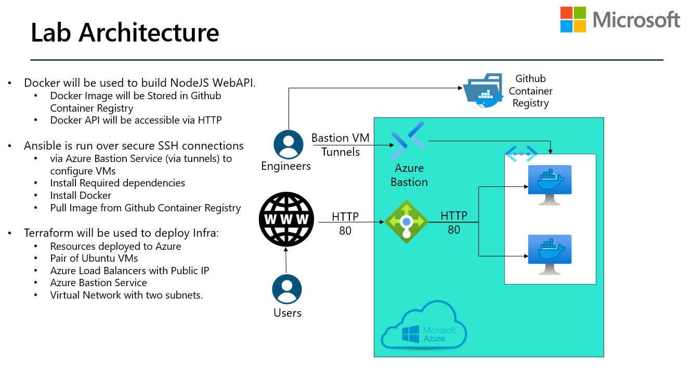

# Introduction to GitOps

Welcome to the **Introduction to GitOps** repository! This repository provides a hands-on learning experience with GitOps workflows, covering foundational tools like Git, Docker, Terraform, and Ansible. Each lab builds on the previous one, enabling you to gain practical knowledge of modern development and infrastructure management practices. 



---

## Lab Overview

### LAB01: Introduction to Git
Learn the fundamentals of Git and GitHub, including creating repositories, managing branches, and collaborating effectively. This lab covers:
- Setting up a GitHub repository using the GitHub CLI.
- Managing branches and updating the README.md file.
- Staging, committing, and pushing changes to a remote repository.
- Creating pull requests, merging changes, and cleaning up your local environment.

[Begin LAB01 ➡](LAB01/LABGUIDE.md)

---

### LAB02: Creating and Managing Docker Images
Build and manage Docker images for a Node.js web application. This lab includes:
- Setting up the application directory and creating a Dockerfile.
- Building and verifying the Docker image locally.
- Running the Docker container locally and testing endpoints.
- Pushing the Docker image to the GitHub Container Registry for sharing and deployment.

[Begin LAB02 ➡](LAB02/LABGUIDE.md)

---

### LAB03: Deploying Infrastructure with Terraform
Deploy and manage infrastructure using Terraform. This lab covers:
- Setting up Terraform configuration files (e.g., `provider.tf`, `main.tf`, `variables.tf`).
- Initializing, planning, and applying Terraform configurations.
- Deploying Azure resources such as virtual networks, load balancers, and virtual machines.
- Managing state files and outputs for infrastructure resources.

[Begin LAB03 ➡](LAB03/LABGUIDE.md)

---

### LAB04: Automating Deployments with Ansible
Use Ansible to automate the deployment of a Web API application. This lab includes:
- Setting up an Ansible environment and inventory file.
- Creating a custom Ansible role to install Docker, pull a container image, and run the application.
- Verifying idempotency and testing the deployed application.
- Using ad-hoc Ansible commands to interact with remote hosts.

[Begin LAB04 ➡](LAB04/LABGUIDE.md)

---

## Getting Started

### Fork the Repository
1. Navigate to the repository on GitHub.
2. Click the **Fork** button in the top-right corner to create a copy of the repository under your GitHub account.

### Launch GitHub Codespaces
1. Open your forked repository on GitHub.
2. Click the **Code** button and select the **Codespaces** tab.
3. Click **Create codespace on main** to launch a development environment in GitHub Codespaces.

### Use the `.devcontainer` Locally
If you prefer to use the `.devcontainer` locally:
1. Clone your forked repository:
   ```sh
   git clone https://github.com/<your-username>/msft-intro-to-gitops
   cd msft-intro-to-gitops
2. Open the repository in Visual Studio Code.
3. Install the Remote - Containers extension in VS Code.
4. Reopen the repository in the container by clicking Reopen in Container in the Command Palette (Ctrl+Shift+P).


---

## Repository Structure

```plaintext
.
├── LAB01/                  # Git Basics
│   ├── [LAB01.md](http://_vscodecontentref_/0)            # Lab guide for Git basics
│   └── [LABGUIDE.md](http://_vscodecontentref_/1)         # Overview of LAB01
├── LAB02/                  # Docker Basics
│   ├── [LAB02.md](http://_vscodecontentref_/2)            # Lab guide for Docker image creation and management
│   └── [LABGUIDE.md](http://_vscodecontentref_/3)         # Overview of LAB02
├── LAB03/                  # Terraform Basics
│   ├── [LAB03.md](http://_vscodecontentref_/4)            # Lab guide for Terraform infrastructure deployment
│   └── [LABGUIDE.md](http://_vscodecontentref_/5)         # Overview of LAB03
├── LAB04/                  # Ansible Basics
│   ├── [LAB01.md](http://_vscodecontentref_/6)            # Ansible setup and usage
│   ├── [LAB02.md](http://_vscodecontentref_/7)            # Ansible role creation and execution
│   └── [LABGUIDE.md](http://_vscodecontentref_/8)         # Overview of LAB04
├── infra/                  # Infrastructure as Code
│   ├── ansible/            # Ansible playbooks and roles
│   └── terraform/          # Terraform configuration files
├── src/                    # Source code for the Web API
│   ├── package.json        # Node.js dependencies
│   └── server.js           # Web API server code
└── [README.md](http://_vscodecontentref_/9)               # Repository documentation